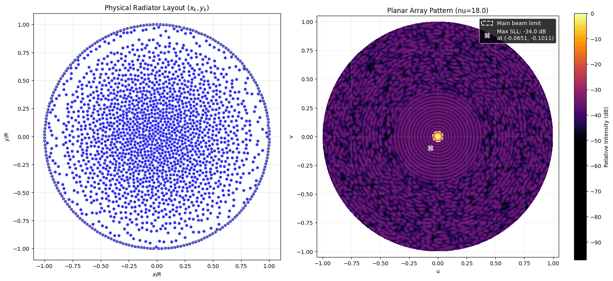

# Continuous Sparse Planar Array Synthesis (Work in Progress)

This repository contains the results of an ongoing research on 2D sparse antenna arrays. The source code is currently private until the paper is submitted.

## Key Features of the Results
* **Continuous Coordinates:** Points are not restricted to a grid.
* **Uniform Amplitude:** All array elements have equal power excitation.
* **Circular Aperture:** Layouts are bounded within a unit circle.

## Folder Structure

* `results/` — Contains the output data.
  * `coordinates/` — Text files with precise `[x, y]` coordinates.
  * `plots/` — Array layouts and 2D pattern graphs. Note: Gray circles represent a safety zone of radius $d_{min}/2$ around each element to ensure physical spacing.

## Benchmarks and Results

All results strictly maintain a physical minimum element spacing of $d_{min} = 0.5\lambda$. The aperture radius $\nu$ is measured in wavelengths ($\lambda$), and the sidelobe exclusion zone radius is fixed at $0.81 / \nu$ for all configurations.

| Elements ($N$) | Radius ($\nu$, in $\lambda$) | PSLL (dB) |
| :--- | :--- | :--- |
| **100** | $4.5$ | **-28.6 dB** |
| **200** | $5.5$ | **-31.1 dB** |
| **300** | $7.0$ | **-31.9 dB** |
| **500** | $9.0$ | **-33.1 dB** |
| **1000** | $12.5$ | **-33.7 dB** |
| **2000** | $18.0$ | **-34.0 dB** |

### Example: 2000 Elements Pattern ($\nu = 18.0$)

Here is the physical layout and the resulting pattern for the 2000-element configuration:

