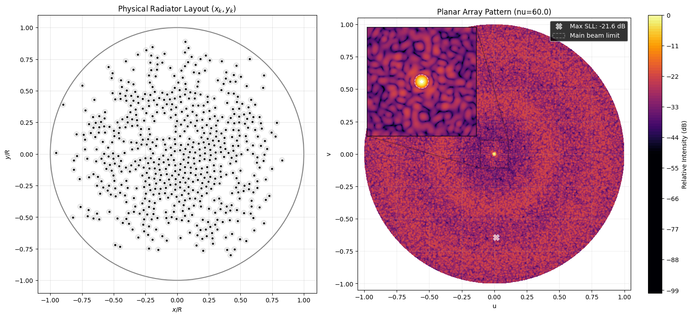

# Continuous Sparse Planar Array Synthesis (Work in Progress)

This repository contains the results of an ongoing research on 2D sparse antenna arrays. The source code is currently private until the paper is submitted.

## Key Features of the Results
* **Continuous Coordinates:** Points are not restricted to a grid.
* **Uniform Amplitude:** All array elements have equal power excitation.
* **Circular Aperture:** Layouts are bounded within a unit circle.

## Folder Structure

* `results/` — Contains the output data.
  * `coordinates/` — Text files with precise `[x, y]` coordinates.
  * `plots/` — Array layouts and 2D pattern graphs. Note: Gray circles represent a safety zone of radius $d_{min}/2$ around each element to ensure physical spacing.

## Benchmarks and Results

All results strictly maintain a physical minimum element spacing of $d_{min} = 0.5\lambda$. The aperture radius $\nu$ is measured in wavelengths ($\lambda$), and the sidelobe exclusion zone radius is fixed at $0.81 / \nu$ for all configurations.

| Elements ($N$) | Radius ($\nu$, in $\lambda$) | PSLL (dB) |
| :--- | :--- | :--- |
| **100** | $4.5$ | **-29.0 dB** |
| **200** | $5.5$ | **-33.2 dB** |
| **300** | $7.0$ | **-33.8 dB** |
| **500** | $9.0$ | **-35.3 dB** |
| **1000** | $12.5$ | **-37.0 dB** |

### State-of-the-Art Benchmarking (600 Elements, $\nu = 60.0$)

To validate the optimization accuracy and structural synthesis capability of the proposed method, a benchmarking experiment was conducted using the 600-element ultra-wideband (UWB) sparse circular planar array configuration described by F. Liu et al. (2023) [DOI: 10.3390/electronics12234833]. 

The reference framework utilizes a Modified Differential Evolution Algorithm (MDEA) and relies on a rigid **15-fold rotational symmetry constraint** ($M=15$) to artificially restrict the search space dimension. Additionally, a structural discrepancy is observed between the reported text and the published graphics: while a peak sidelobe level (PSLL) of **$-20.12$ dB** is stated in the text, the corresponding radiation pattern cuts (Fig. 4b) clearly exhibit localized 2D sidelobe peaks reaching approximately **$-18.50$ dB**, indicating potential optimization stagnation or an insufficiently dense verification grid.

In contrast, the proposed hybrid 1D/2D Newton-Raphson optimization framework operates with **fully unconstrained, independent elements** (1200 degrees of freedom). Validated by an exhaustive, independent brute-force 2D scan grid, the proposed method successfully achieved a verified, solid 2D peak SLL of **$-21.60$ dB**. 

By managing all elements completely independently without geometric symmetry constraints, the proposed deterministic analytical framework demonstrates a **$3.10$ dB improvement** over the verified reference pattern cuts, proving that exact second-order analytical derivatives can resolve dense, non-convex 2D landscapes far more effectively than global stochastic search heuristics.

Here is the physical layout and the resulting pattern for the verified 600-element configuration ($\nu = 60.0$), maintaining a highly focused main beam with a sharp beamwidth of approximately **$1.55^\circ$**:

