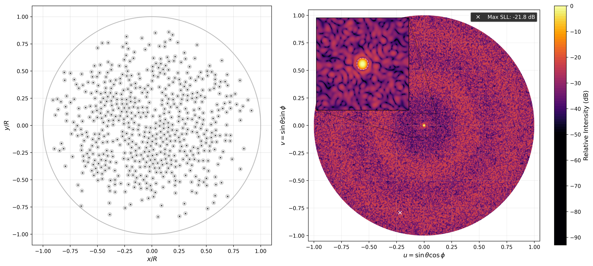
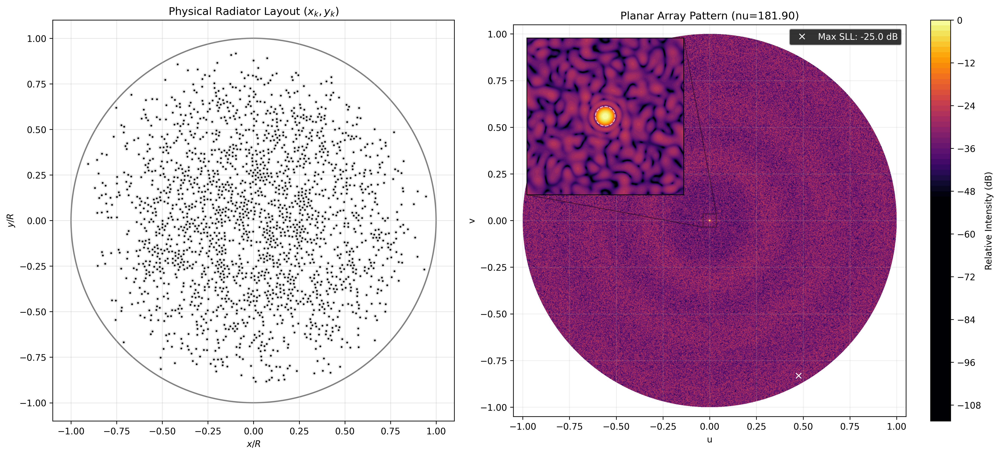

# Continuous Sparse Planar Array Synthesis (Work in Progress)

This repository contains the results of an ongoing research on 2D sparse antenna arrays. The source code is currently private until the paper is submitted. https://zenodo.org/records/20298078

## Key Features of the Results
* **Continuous Coordinates:** Points are not restricted to a grid.
* **Uniform Amplitude:** All array elements have equal power excitation.
* **Circular Aperture:** Layouts are bounded within a unit circle.

## Folder Structure

* `optimizer_numba.py` — The core high-performance parallel array synthesis engine accelerated via Numba.
* `requirements.txt` — Specifies the package dependency baseline required for executing the high-performance computing pipeline.
* `results/` — Contains the validated framework synthesis output data.
  * `coordinates/` — High-precision text files containing the final `[x, y]` radiator distributions.
  * `plots/` — Synthesized geometric array layouts and verified 2D radiation pattern graphs. Note: Gray circles represent the element separation safety zone ($d_{\min}/2$) strictly preventing structural overlap.

## Benchmarks and Results

All results strictly maintain a physical minimum element spacing of $d_{min} = 0.5\lambda$. The aperture radius $\nu$ is measured in wavelengths ($\lambda$), and the sidelobe exclusion zone radius is fixed at $0.81 / \nu$ for all configurations.

| Elements ($N$) | Radius ($\nu, \lambda$) | PSLL (dB) | HPBW (-3 dB) | Verification Plot | Coordinates File |
| :---: | :---: | :---: | :---: | :---: | :---: |
| **100** | $4.5$ | **-29.0** | **8.3°** | [[View Plot]](results/plots/interference_plot_n=100_r=4.5.png) | [[TXT]](results/coordinates/coordinates_2d_N=100_r=4.5lam.txt) |5
| **200** | $5.5$ | **-33.2** | **6.5°** | [[View Plot]](results/plots/interference_plot_n=200_r=5.5.png) | [[TXT]](results/coordinates/coordinates_2d_N=200_r=5.5lam.txt) |
| **300** | $7.0$ | **-33.8** | **5.0°** | [[View Plot]](results/plots/interference_plot_n=300_r=7.0.png) | [[TXT]](results/coordinates/coordinates_2d_N=300_r=7.0lam.txt) |
| **500** | $9.0$ | **-35.3** | **3.9°** | [[View Plot]](results/plots/interference_plot_n=500_r=9.0.png) | [[TXT]](results/coordinates/coordinates_2d_N=500_r=9.0lam.txt) |
| **1000** | $12.5$ | **-37.0** | **2.7°** | [[View Plot]](results/plots/interference_plot_n=1000_r=12.5.png) | [[TXT]](results/coordinates/coordinates_2d_N=1000_r=12.5lam.txt) |

## UWB Sparse Planar Array with 600 Elements and 5:1 Bandwidth ($\nu = 60.0$, minimum element spacing constraint of $d_{\min} = 2.5\lambda_H$) 

To evaluate the optimization accuracy and structural synthesis capability of the proposed framework, a benchmarking experiment was conducted against a 600-element ultra-wideband (UWB) sparse circular planar array described by F. Liu et al. (2023) [DOI: 10.3390/electronics12234833] [article](https://www.mdpi.com/2079-9292/12/23/4833).

The reference method utilizes a Modified Differential Evolution Algorithm (MDEA) under a rigid 15-fold rotational symmetry constraint ($M=15$) to artificially restrict the search space dimension. A discrepancy is observed between the reported text and the published graphics: while a peak sidelobe level (PSLL) of $-20.12$ dB is stated in the text, the corresponding radiation pattern cuts (Fig. 4b) exhibit localized 2D sidelobe peaks reaching approximately $-18.50$ dB. This indicates potential optimization stagnation or an insufficiently dense verification grid in the reference study.

In contrast, the proposed continuous 2D Newton-Raphson gradient descent optimization framework operates with fully unconstrained, independent elements, managing 1200 degrees of freedom. Validated by an exhaustive independent brute-force $1920 \times 1920$ 2D scan grid, the proposed method achieved a verified 2D peak SLL of **$-21.80$ dB**.

The resulting physical layout and the radiation pattern for the verified 600-element configuration ($\nu = 60.0$) are illustrated below, showcasing a highly focused main beam with a sharp half-power beamwidth of approximately **$1.55^\circ$**:

## 2000-Element Square Kilometer Array (SKA) Operating over 70 MHz to 450 MHz ($\nu = 181.9$)
The reference method utilizes a Modified Differential Evolution Algorithm (MDEA) under a rigid 25-fold rotational symmetry constraint ($M=25$) to restrict the search space dimension, achieving a reported PSLL of $-19.46$ dB. In contrast, the proposed continuous 2D Newton-Raphson optimization framework operates with fully unconstrained, independent elements. Validated by an exhaustive independent brute-force $5820 \times 5820$ 2D scan grid, the proposed method achieved a verified 2D peak SLL of **$-25.04$ dB**, providing a definitive **$5.58$ dB** improvement over the reference study while maintaining a physical minimum inter-element spacing of $d_{\min}=3.21\lambda_H$.

The resulting physical layout and the radiation pattern for the verified 2000-element configuration ($\nu = 181.9$) are illustrated below, showcasing a highly focused main beam with a sharp half-power beamwidth of approximately **$1.10^\circ$**:

